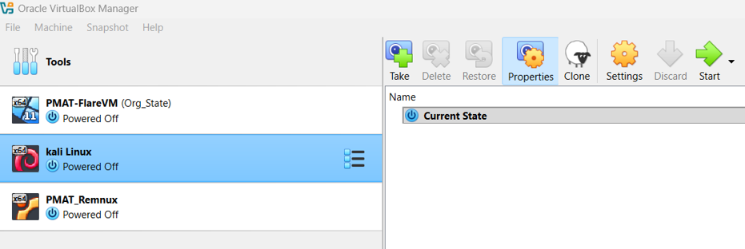
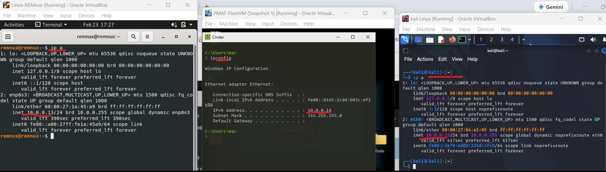
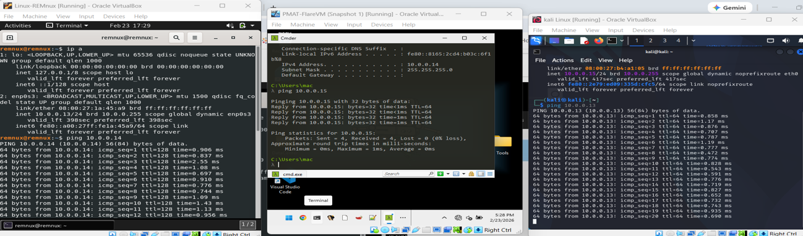
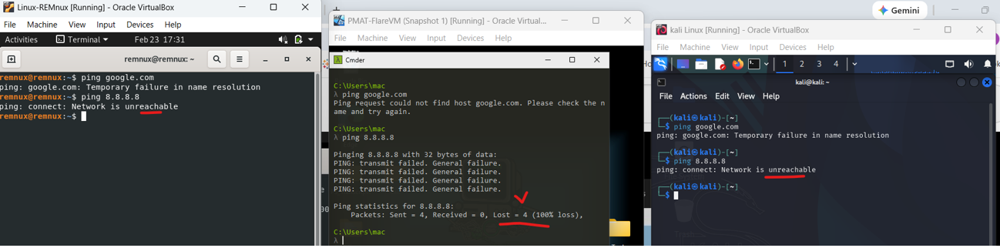
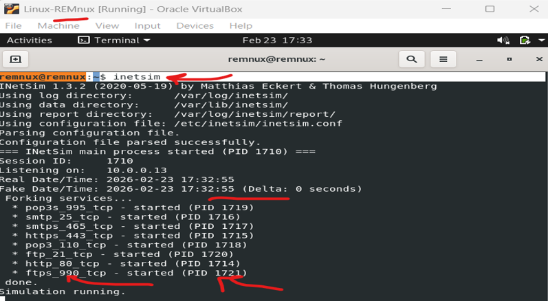
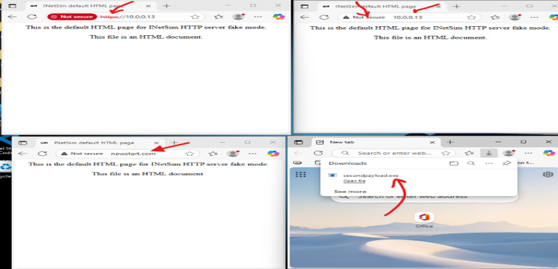
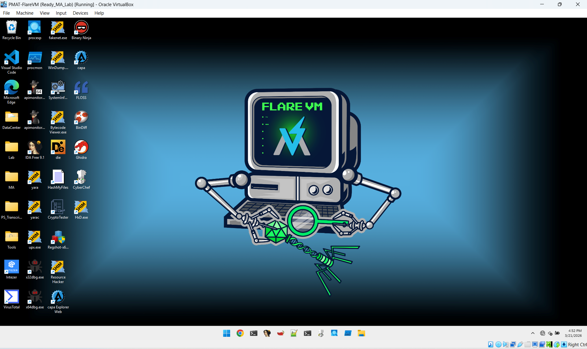

# **Cyber Lab Environment Setup Guide (Home Lab)**  
**Date:** 03/21/2026  

## **1. Purpose of the Cyber Lab**
This cyber lab environment is designed to support hands‑on learning and professional practice in the following areas:

- Reverse engineering and malware analysis (static and dynamic analysis)
- Offensive and defensive hands-on security
- System and database administration
- Vulnerability assessment and management
- Network traffic analysis (e.g., Wireshark)
- Web application security, CTF challenges, and REST API development (Python & Java technology stacks)
- Network management and security
- Security operations and monitoring
- Automation and orchestration of common security workflows
- Fundamentals of Governance, Risk, and Compliance (GRC)

---

## **2. Implementation Overview**



### **2.1 Virtualization Platform**
- Deployment options:  
  - **Cloud:** AWS, Azure, or GCP  
  - **Local:** Windows 11 host system  
- Virtualization type: **Type 2 hypervisor**
- Selected platform: **Oracle VirtualBox**

### **2.2 Required Software**
1. **Oracle VirtualBox**  
   `https://www.oracle.com/virtualization/technologies/vm/downloads/virtualbox-downloads.html` [(oracle.com in Bing)](https://www.bing.com/search?q="https%3A%2F%2Fwww.oracle.com%2Fvirtualization%2Ftechnologies%2Fvm%2Fdownloads%2Fvirtualbox-downloads.html")  
2. **Windows 11 ISO**  
   `https://www.microsoft.com/en-us/software-download/windows11` [(microsoft.com in Bing)](https://www.bing.com/search?q="https%3A%2F%2Fwww.microsoft.com%2Fen-us%2Fsoftware-download%2Fwindows11")  
3. **FlareVM (PowerShell installation script)**  
   [https://github.com/mandiant/flare-vm](https://github.com/mandiant/flare-vm)  
4. **REMnux (OVA image)**  
   `https://remnux.org/#distro` [(remnux.org in Bing)](https://www.bing.com/search?q="https%3A%2F%2Fremnux.org%2F%23distro")  
5. **Kali Linux**  
   `https://www.kali.org/get-kali/#kali-platforms` [(kali.org in Bing)](https://www.bing.com/search?q="https%3A%2F%2Fwww.kali.org%2Fget-kali%2F%23kali-platforms")  

---

## **3. High-Level Cyber Lab Architecture**

1. The host system runs **Windows 11 Home Edition**.  
2. **Oracle VirtualBox** is used as the virtualization platform.  
3. Three guest operating systems are installed:  
   - **FlareVM** (Windows 11)  
   - **REMnux**  
   - **Kali Linux**  
4. A **Host-Only Network** named *Ethernet Adapter #2* is created for the lab.  
5. All guest systems are configured to communicate **only with each other**, with **no access** to:  
   - The Internet  
   - The host operating system  
6. Internal communication is validated by ensuring all three guests can successfully ping one another.  
7. A predefined IP range is assigned using either DHCP or static addressing.  
8. **VirtualBox Guest Additions** are installed on each VM to enable enhanced features such as full‑screen mode.  
9. Snapshots of each fully configured VM are created as **baseline “clean state” images** for safe rollback after malware detonation.

---

## **4. Network Configuration**

### **4.1 Host-Only Network Setup**
Create a new Host-Only Adapter with the following configuration:

| Setting | Value |
|--------|--------|
| IPv4 Address | 10.0.0.1 |
| IPv4 Netmask | 255.255.255.0 |
| DHCP Server Enabled | Yes |
| DHCP Server Address | 10.0.0.2 |
| DHCP Mask | 255.255.255.0 |
| Lower Address Bound | 10.0.0.3 |
| Upper Address Bound | 10.0.0.254 |

This network acts as the isolated internal network for all guest OS communication.

---

### **4.2 Guest OS Network Configuration**

#### **FlareVM (Windows 11)**
- Enable the network adapter.
- Set **Adapter Type: Host-Only Adapter**.
- Select **Host-Only Network #2**.
- Disable all other network adapters.

#### **REMnux & Kali Linux**
- Apply the same configuration as FlareVM.

**Objective:**  
Allow internal communication between all guest OS while preventing any external connectivity.

---

## **5. Network Testing**

### **5.1 Verify Internal Communication**
Retrieve IP addresses:

- REMnux: **10.0.0.13**  
- FlareVM: **10.0.0.14**  
- Kali Linux: **10.0.0.15**




Test connectivity using `ping`:

- REMnux → FlareVM  
- FlareVM → Kali  
- Kali → REMnux  

All pings should succeed.



### **5.2 Verify External Isolation**
From each guest OS:

```
ping google.com
ping 8.8.8.8
```

All attempts must **fail**, confirming isolation from the Internet and host OS.


---

## **6. Network Simulation with REMnux (INetSim)**

### **6.1 Start INetSim**
On REMnux:

```
inetsim
```

This displays active simulated services, ports, and process IDs.



### **6.2 Enable DNS Simulation**
Edit the INetSim configuration:

```
sudo nano /etc/inetsim/inetsim.conf
```

Modify the following:

- Uncomment DNS service:

```
start_service dns
```

- Allow binding to all interfaces:

```
service_bind_address 0.0.0.0
```

- Keep default DNS port (53) and default DNS IP.

Save and exit:

- **Ctrl + O** → Save  
- **Enter** → Confirm  
- **Ctrl + X** → Exit  

### **6.3 Test INetSim Landing Page**
With INetSim running:

- From FlareVM, open browser and navigate to:  
  **`http://10.0.0.13` [(10.0.0.13 in Bing)](https://www.bing.com/search?q="http%3A%2F%2F10.0.0.13%2F")**

### **6.4 Configure FlareVM DNS**
Set DNS server to:

- **10.0.0.13 (REMnux)**

This forces all domain lookups to resolve to INetSim.



---

## **7. Snapshots**
Create snapshots for all VMs labeled:

- **“Pre‑Detonation”**

These serve as rollback points after malware execution.

---

## **8. Hands-On Malware Analysis Guidelines**

- Always prioritize safety.  
- All malware samples are compressed and encrypted with password: **infected**  
- Ensure all VMs are fully isolated before detonating any sample.  
- Complete labs in the provided sequence.  
- Document findings using standard malware analysis reporting practices.

---

## **9. Safe Malware Sample Sources**

### **Recommended Repositories**
1. **The Zoo (Live Malware Repository)**  
   [https://github.com/ytisf/theZoo](https://github.com/ytisf/theZoo)  
   ```
   git clone https://github.com/ytisf/theZoo.git
   ```

2. **VX Underground – Malware Source Code**  
   `https://github.com/vxunderground/MalwareSourceCode` [(github.com in Bing)](https://www.bing.com/search?q="https%3A%2F%2Fgithub.com%2Fvxunderground%2FMalwareSourceCode")  
   ```
   git clone https://github.com/vxunderground/MalwareSourceCode.git
   ```
   *Do not visit their official website.*

3. **Lenny Zeltser’s Malware Sample Sources**  
   `https://zeltser.com/malware-sample-sources/` [(zeltser.com in Bing)](https://www.bing.com/search?q="https%3A%2F%2Fzeltser.com%2Fmalware-sample-sources%2F")

---

## **10. Static Analysis Tools (Top 10)**

- Ghidra  
- IDA Pro  
- Binary Ninja  
- Detect-It-Easy (DIE)  
- FLOSS  
- CFF Explorer / PE-bear  
- Capa  
- Radare2 / Cutter  
- YARA  
- VirusTotal / Intezer Analyze  

---

## **11. Dynamic Analysis Tools (Top 10)**

- Cuckoo Sandbox  
- ANY.RUN  
- Hybrid Analysis  
- Process Monitor (ProcMon)  
- Process Hacker 2 / System Informer  
- x64dbg / x32dbg  
- Wireshark  
- Fakenet-NG  
- Frida  
- Volatility 3  
- CyberChef  


---


<p align="center">FlareVM on Windows </p>

---
